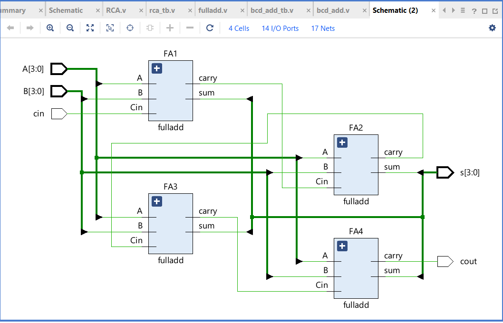
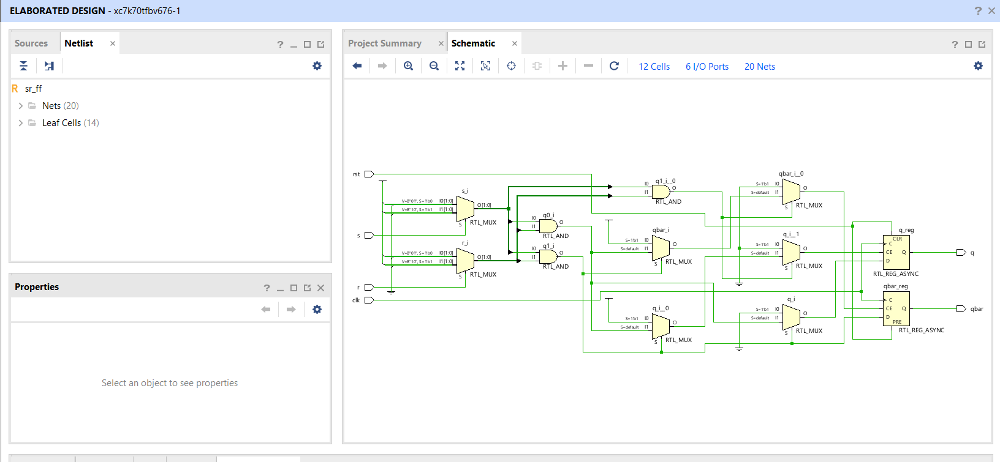
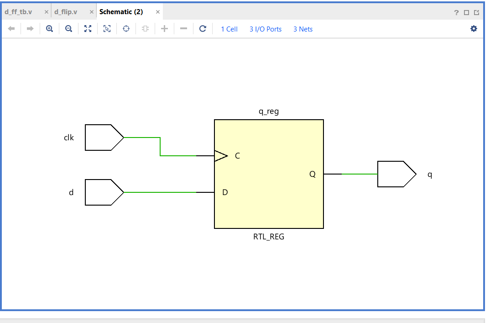
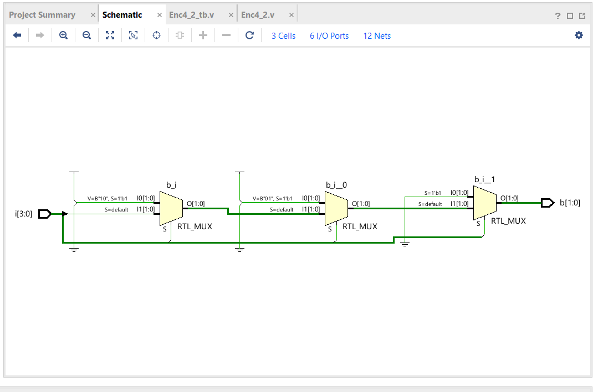
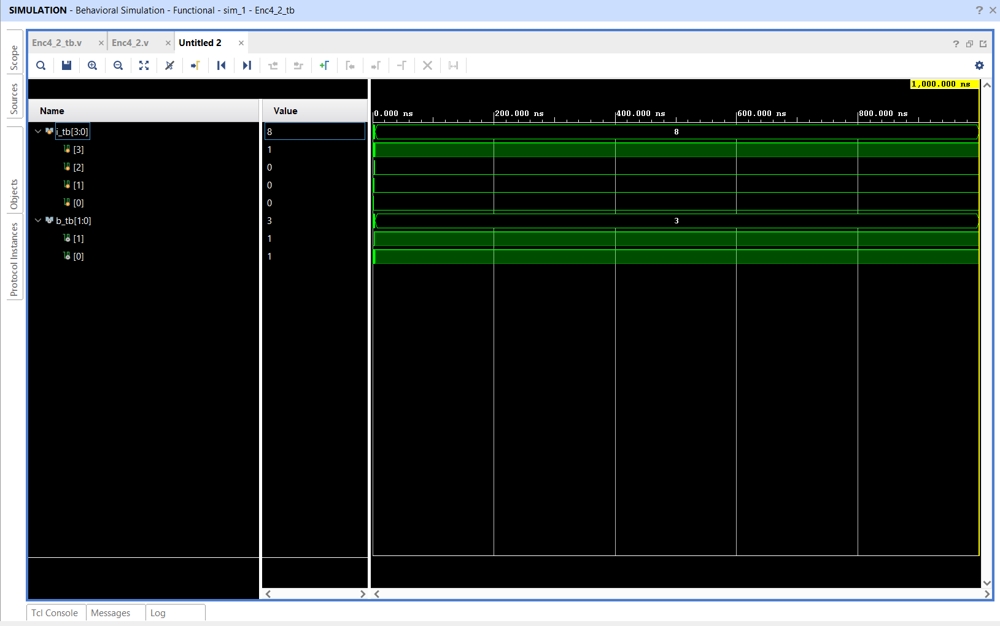
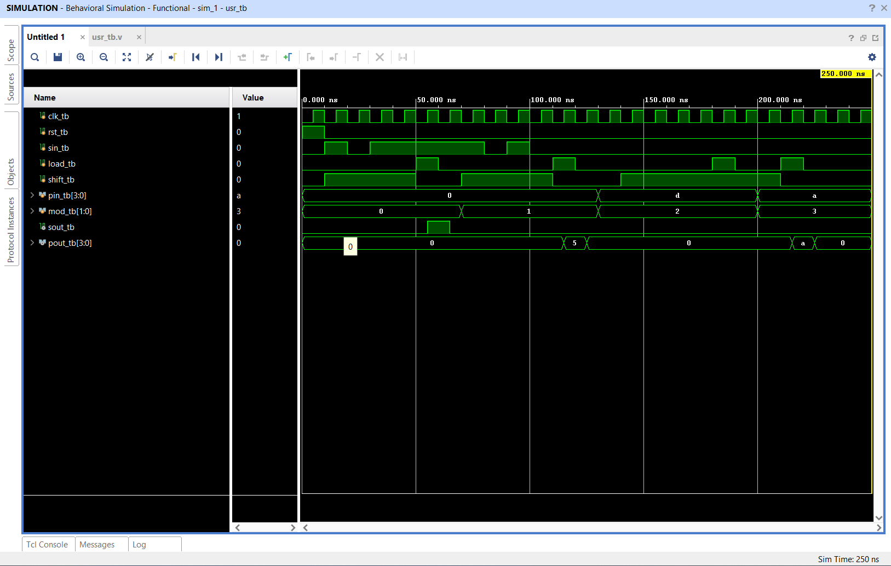
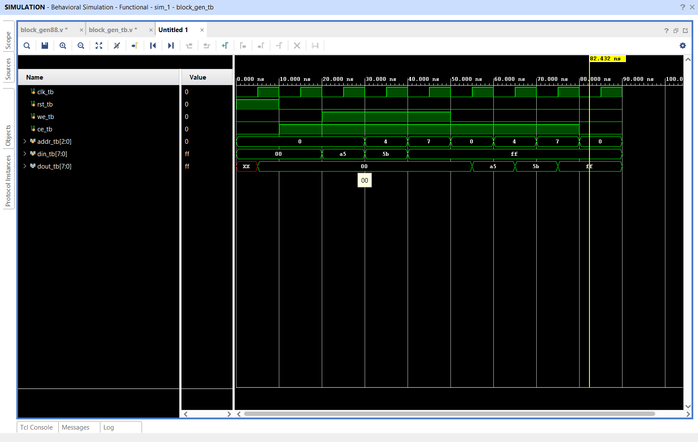

# 15-Day Industrial Internship: Advanced RTL Architecture & Verilog HDL
> Hosted by the **TKM College of Engineering (TKMCE)**

This repository forms a structured, verified portfolio of synthesizable Verilog HDL hardware designs, verification testbenches, and physical layout diagnostics compiled during the 15-day Industrial Training Program. All modules are designed for deterministic hardware execution and fully verified via behavioral and timing simulation.

---

## 👤 Engineering Trainee Profile

*   **Name:** Aiswarya S
*   **Discipline:** Electronics & Communication Engineering
*   **Institution:** TKM College of Engineering (TKMCE)
*   **EDA Toolchain:** Xilinx Vivado Design Suite
*   **Target Language:** Verilog HDL (IEEE 1364-2001)

---

## 📂 Repository Directory Map

```text
TKM_INTERNSHIP/
├── day1/
│   ├── BCD_Adder/─────────────── [design/bcd.v] [tb/bcd_tb.v] [bcd.md]
│   └── Ripple_Carry_Adder/────── [design/RCA.v, fulladd.v] [tb/rca_tb.v] [rca.md, rca.png.png]
├── day2/
│   ├── SR_flipflop/───────────── [design/sr_ff.v] [tb/sr_ff_tb.v] [sequence.png]
│   ├── d_flipflop/────────────── [design/d_ff.v] [tb/d_fftb.v] [dflipflop.md, Schematic_d_ff.png]
│   ├── encoder/───────────────── [design/enc.v] [tb/enc_tb.v] [encoder.md, Schematic.png, encoder4x2.png]
│   └── usr/───────────────────── [design/usr.v] [tb/usr_tb.v] [usr.md, usr.png]
├── day3/
│   ├── Face_Scan_system/──────── [design/face_mod.v, fifo.v, mod_out.v, top.v] [tb/fss_tb.v] [fss.md]
│   └── Sequence detector/─────── [design/sequence.v] [tb/sequence_tb.v] [sd.md, Sequence_detector.png]
└── day4/
    └── block_gen88/───────────── [design/block_generator.v] [tb/tb.v] [block_gen.md, bg88.png]
```

---

## 📅 Chronological Core Design Registry

### 🛠️ Day 01: Combinational Arithmetic Optimization
Focuses on mapping mathematical operations into primitive combinational logic, emphasizing boundary correction and linear propagation analysis.

*   **Decimal Boundary Corrected (BCD) Adder Unit**
    *   📁 **RTL Design:** [`day1/BCD_Adder/design/bcd.v`](day1/BCD_Adder/design/bcd.v) — Deploying raw summation evaluation and active $+6$ vector adjustments.
    *   🧪 **Testbench:** [`day1/BCD_Adder/tb/bcd_tb.v`](day1/BCD_Adder/tb/bcd_tb.v) — Exhaustive case verification script profiling mathematical thresholds.
    *   📖 **Documentation:** [`day1/BCD_Adder/bcd.md`](day1/BCD_Adder/bcd.md) — Comprehensive logic adjustment and architectural specification rules.
*   **Structural Multi-Bit Ripple Carry Adder (RCA)**
    *   📁 **RTL Design:** [`day1/Ripple_Carry_Adder/design/RCA.v`](day1/Ripple_Carry_Adder/design/RCA.v) — Cascaded top-level fabric grouping structural 1-bit full adders.
    *   🧩 **Sub-Module:** [`day1/Ripple_Carry_Adder/design/fulladd.v`](day1/Ripple_Carry_Adder/design/fulladd.v) — Primitive 1-bit full adder hardware building block.
    *   🧪 **Testbench:** [`day1/Ripple_Carry_Adder/tb/rca_tb.v`](day1/Ripple_Carry_Adder/tb/rca_tb.v) — Testbench for boundary overflow timing tracing ($O(N)$ delay path).
    *   📖 **Documentation:** [`day1/Ripple_Carry_Adder/rca.md`](day1/Ripple_Carry_Adder/rca.md) — Technical notes charting critical propagation delay properties.
    *   🖼️ **RTL Layout:**
        

---

### 💾 Day 02: Synchronous Memory Elements & Prioritization Networks
Explores clock-edge synchronization, state-holding properties, hazard mitigation, and complex parallel data manipulation matrices.

*   **Bistable State-Retention SR Flip-Flop**
    *   📁 **RTL Design:** [`day2/SR_flipflop/design/sr_ff.v`](day2/SR_flipflop/design/sr_ff.v) — Pure behavioral logic model detailing truth table boundaries.
    *   🧪 **Testbench:** [`day2/SR_flipflop/tb/sr_ff_tb.v`](day2/SR_flipflop/tb/sr_ff_tb.v) — Simulator sequence checking setup actions and isolating the indeterminate state.
    *   🖼️ **Simulation:**
        
*   **Asynchronous-Clear Edge-Triggered D Flip-Flop**
    *   📁 **RTL Design:** [`day2/d_flipflop/design/d_ff.v`](day2/d_flipflop/design/d_ff.v) — Sequentially deterministic storage module featuring clock-independent clear control overrides.
    *   🧪 **Testbench:** [`day2/d_flipflop/tb/d_fftb.v`](day2/d_flipflop/tb/d_fftb.v) — Simulation setup injecting clock-asynchronous control violations.
    *   📖 **Documentation:** [`day2/d_flipflop/dflipflop.md`](day2/d_flipflop/dflipflop.md) — Timing profiles for setup, hold, and reset recovery.
    *   🖼️ **Schematic:**
        
*   **4-to-2 Priority Combinational Encoder**
    *   📁 **RTL Design:** [`day2/encoder/design/enc.v`](day2/encoder/design/enc.v) — Hardware design featuring overlapping multi-input prioritization masking.
    *   🧪 **Testbench:** [`day2/encoder/tb/enc_tb.v`](day2/encoder/tb/enc_tb.v) — Functional verification script tracing overlapping line assertions.
    *   📖 **Documentation:** [`day2/encoder/encoder.md`](day2/encoder/encoder.md) — Architectural notes detailing Boolean priority mapping parameters.
    *   🖼️ **Visual Assets:**
        
        
*   **Multi-Mode Universal Shift Register (USR)**
    *   📁 **RTL Design:** [`day2/usr/design/usr.v`](day2/usr/design/usr.v) — Multi-purpose storage element handling parallel loading and directional bit shifting.
    *   🧪 **Testbench:** [`day2/usr/tb/usr_tb.v`](day2/usr/tb/usr_tb.v) — Timing stimulus file precisely mapping the 250ns Vivado verification run.
    *   📖 **Documentation:** [`day2/usr/usr.md`](day2/usr/usr.md) — Operational control routing logic breakdown.
    *   🖼️ **Simulation:**
        

---

### ⚙️ Day 03: System Integration & Finite State Automata
Advances into multi-module structural architecture, cross-domain data synchronization, and pattern-tracking state pipelines.

*   **Modular Face Scanning System Wrapper**
    *   📁 **Top Module:** [`day3/Face_Scan_system/design/top.v`](day3/Face_Scan_system/design/top.v) — Structural system wrapper coordinating memory cores and processing components.
    *   🔌 **Sub-Module:** [`day3/Face_Scan_system/design/face_mod.v`](day3/Face_Scan_system/design/face_mod.v) — Sensor input matrix interface decoder stage.
    *   🔌 **Sub-Module:** [`day3/Face_Scan_system/design/fifo.v`](day3/Face_Scan_system/design/fifo.v) — Elastic circular queue memory structure buffering disparate processing rates.
    *   🔌 **Sub-Module:** [`day3/Face_Scan_system/design/mod_out.v`](day3/Face_Scan_system/design/mod_out.v) — Parallel-to-serial protocol interface manager.
    *   🧪 **Testbench:** [`day3/Face_Scan_system/tb/fss_tb.v`](day3/Face_Scan_system/tb/fss_tb.v) — System-level validation module auditing handshake signals.
    *   📖 **Documentation:** [`day3/Face_Scan_system/fss.md`](day3/Face_Scan_system/fss.md) — Queue flow control architecture specifications document.
*   **Non-Overlapping Sequence Detector (1110 Binary Stream)**
    *   📁 **RTL Design:** [`day3/Sequence%20detector/design/sequence.v`](day3/Sequence%20detector/design/sequence.v) — Two-always-block Finite State Machine (FSM) resetting immediately post-match.
    *   🧪 **Testbench:** [`day3/Sequence%20detector/tb/sequence_tb.v`](day3/Sequence%20detector/tb/sequence_tb.v) — Serial data driver ensuring structural non-overlapping validation.
    *   📖 **Documentation:** [`day3/Sequence%20detector/sd.md`](day3/Sequence%20detector/sd.md) — State transition matrix mapping documentation.
    *   🖼️ **State Diagram:**
        

---

### 🧬 Day 04: Parameterized Macro-Logic Layout Elaboration
Examines hardware scalability, automated module replication, and compiler-driven structural expansion layouts.

*   **Parameterized Block Generator 88 Scheme**
    *   📁 **RTL Design:** [`day4/block_gen88/design/block_generator.v`](day4/block_gen88/design/block_generator.v) — RTL implementation employing `generate` structures to automate structural block expansion.
    *   🧪 **Testbench:** [`day4/block_gen88/tb/tb.v`](day4/block_gen88/tb/tb.v) — Parallel channel stimulus suite assessing vector routing spaces.
    *   📖 **Documentation:** [`day4/block_gen88/block_gen.md`](day4/block_gen88/block_gen.md) — Scaling parameters specification sheet ($N$-bit array adjustments).
    *   🖼️ **Simulation:**
        

---

## ⚙️ Engineering Simulation & Verification Flow

All intellectual property (IP) blocks in this library are developed, synthesized, and rigorously tested inside the native **Xilinx Vivado Design Suite** logic simulation interface.

```drawio
[RTL Design Source (.v)] ──> [Attach Verification Testbench (_tb.v)] ──> [Execute Behavioral Simulation] ──> [Audit Waveforms via Logic Analyzer]
```

1.  **RTL Source Ingestion:** Hardware modules under the respective `/design/` trees are tracked as primary logic targets.
2.  **Verification Phase:** Matching simulation setups under the `/tb/` components act as active stimulus benches, running clock-synchronized test profiles.
3.  **Waveform Diagnostics:** Output timing charts are carefully audited using the Vivado Logic Analyzer to confirm total logical and architectural consistency before saving.
