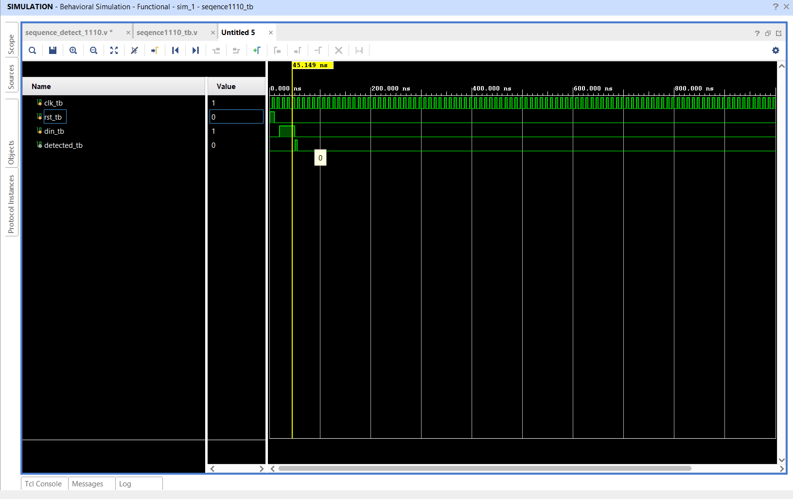

# 15-Day Digital Design Architecture Portfolio | TKMCE

This repository contains the hardware design blocks, simulation environments, and RTL verification logs compiled during the 15-day industrial internship program hosted by the TKM College of Engineering.

---

## 🧑‍💻 Student Profile

*   **Name:** Aiswarya S
*   **Major:** Electronics and Communication Engineering
*   **Affiliation:** TKM College of Engineering (TKMCE)
*   **Toolchain:** Xilinx Vivado Design Suite
*   **Hardware Description Language:** Verilog HDL

---

## 📅 Chronological Module Registry

### 📂 Day 01: Combinational Arithmetic Engines
Focus on the implementation and validation of fundamental binary addition units.

*   **Binary Coded Decimal (BCD) Adder Unit**
    *   [`day1/BCD_Adder/design/bcd.v`](day1/BCD_Adder/design/bcd.v) — RTL logic for decimal-corrected binary addition.
    *   [`day1/BCD_Adder/tb/bcd_tb.v`](day1/BCD_Adder/tb/bcd_tb.v) — Stimulus block validating arithmetic boundaries.
    *   [`day1/BCD_Adder/bcd.md`](day1/BCD_Adder/bcd.md) — Behavioral rules and block documentation.
*   **Ripple Carry Adder (RCA)**
    *   [`day1/Ripple_Carry_Adder/design/RCA.v`](day1/Ripple_Carry_Adder/design/RCA.v) — Multi-bit cascaded adder fabric top module.
    *   [`day1/Ripple_Carry_Adder/design/fulladd.v`](day1/Ripple_Carry_Adder/design/fulladd.v) — 1-bit full adder hardware building block.
    *   [`day1/Ripple_Carry_Adder/tb/rca_tb.v`](day1/Ripple_Carry_Adder/tb/rca_tb.v) — Comprehensive functional validation file.
    *   [`day1/Ripple_Carry_Adder/rca.md`](day1/Ripple_Carry_Adder/rca.md) — Propagation delay and carry ripple timing analysis.
    *   

---

### 📂 Day 02: Synchronous Memory Cells & Data Routing
Exploration of clock-edge triggered storage blocks and input prioritization matrices.

*   **SR Flip-Flop**
    *   [`day2/SR_flipflop/design/sr_ff.v`](day2/SR_flipflop/design/sr_ff.v) — Logic model for set-reset state behavior.
    *   [`day2/SR_flipflop/tb/sr_ff_tb.v`](day2/SR_flipflop/tb/sr_ff_tb.v) — Test suite handling normal and invalid state transitions.
*   **D Flip-Flop**
    *   [`day2/d_flipflop/design/d_ff.v`](day2/d_flipflop/design/d_ff.v) — Edge-triggered data latching circuit.
    *   [`day2/d_flipflop/tb/d_fftb.v`](day2/d_flipflop/tb/d_fftb.v) — Signal injection verification script.
    *   
*   **Encoder Subsystem**
    *   [`day2/encoder/design/enc.v`](day2/encoder/design/enc.v) — Multi-input encoding prioritization logic.
    *   [`day2/encoder/tb/enc_tb.v`](day2/encoder/tb/enc_tb.v) — Functional test cases for line encoding.
    *   
    *   
*   **Universal Shift Register (USR)**
    *   [`day2/usr/design/usr.v`](day2/usr/design/usr.v) — Multi-mode register handling bi-directional shifting and parallel operations.
    *   [`day2/usr/tb/usr_tb.v`](day2/usr/tb/usr_tb.v) — Verification script covering all internal operational modes.

---

### 📂 Day 03: Sequential State Machines & Stream Processing
Implementation of synchronized memory arrays and pattern tracking automata.

*   **Face Scanning System Infrastructure**
    *   [`day3/Face_Scan_system/design/top.v`](day3/Face_Scan_system/design/top.v) — Top-level structural wrapper integrating the sub-modules.
    *   [`day3/Face_Scan_system/design/face_mod.v`](day3/Face_Scan_system/design/face_mod.v) — Sensor stream processing engine.
    *   [`day3/Face_Scan_system/design/fifo.v`](day3/Face_Scan_system/design/fifo.v) — Asynchronous queue buffer managing internal data rates.
    *   [`day3/Face_Scan_system/design/mod_out.v`](day3/Face_Scan_system/design/mod_out.v) — Output formatting interface manager.
    *   [`day3/Face_Scan_system/tb/fss_tb.v`](day3/Face_Scan_system/tb/fss_tb.v) — System-level validation setup with active input streams.
*   **Pattern Sequence Detector**
    *   [`day3/Sequence detector/design/sequence.v`](day3/Sequence detector/design/sequence.v) — Finite State Machine (FSM) capturing custom serial data sequences.
    *   [`day3/Sequence detector/tb/sequence_tb.v`](day3/Sequence detector/tb/sequence_tb.v) — Serial stream bit injection simulation.
    *   

---

### 📂 Day 04: Parameterized Logic Automation
Leveraging compiler directives for scalable hardware generation layouts.

*   **Block Generator 88 Project**
    *   [`day4/block_gen88/design/block_generator.v`](day4/block_gen88/design/block_generator.v) — Structural code exploiting looping structures for block expansion.
    *   [`day4/block_gen88/tb/tb.v`](day4/block_gen88/tb/tb.v) — Array boundary verification test block.
    *   

---

## ⚙️ Development & Verification Workflow

The entire design library is constructed and simulated within the **Xilinx Vivado** native environment.

1. **Source Integration:** Design assets inside the `/design/` folders are tracked as active project sources.
2. **Verification Loop:** Associated verification modules inside the `/tb/` subdirectories are executed to trace functional correctness.
3. **Waveform Inspection:** Timing behaviors and logic maps are audited via the built-in Vivado logic simulator tool.
