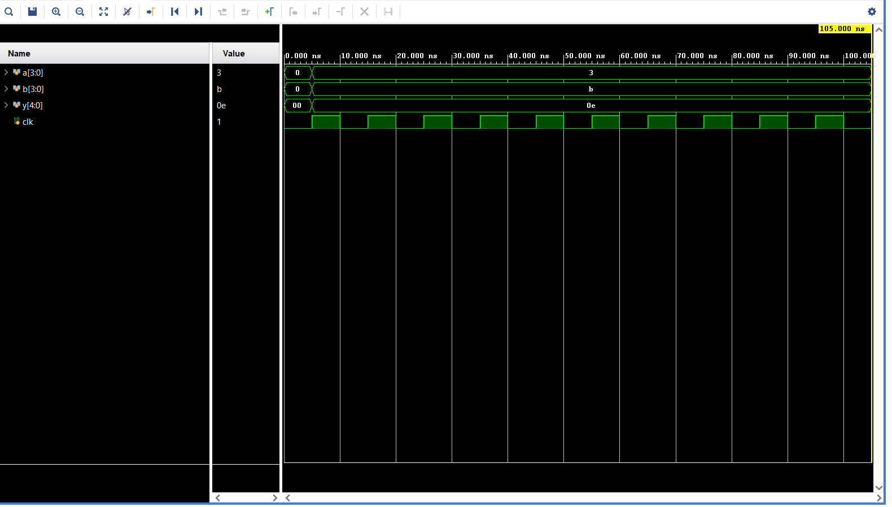

# Vivado Task Simulation Report

This document records the simulation waveform trace and behavioral evaluation for the task-based SystemVerilog testbench.

## Simulation Summary

- **Simulator Engine:** AMD Vivado XSim
- **Target Snapshot:** `tb_behav`
- **Total Command Runtime:** 105.000 ns
- **Clock Configuration:** Period of 10 ns (`always #5 clk = ~clk`)

---

## Simulation Waveform

---

## Waveform Signal Data Values

Below is the state of the simulation signals at the cursor boundary captured from the Vivado Waveform Viewer window:

| Signal Name | Format | Value at Cursor | Description |
| :--- | :---: | :---: | :--- |
| `a[3:0]` | Hexadecimal | `3` | First randomized input operand |
| `b[3:0]` | Hexadecimal | `b` | Second randomized input operand (Decimal: 11) |
| `y[4:0]` | Hexadecimal | `0e` | Result output calculated from the task (Decimal: 14) |
| `clk` | Binary | `1` | Generated simulation system clock |

---

## Functional Verification Breakdown

The waveform trace verifies that your task handles procedural signal execution synchronously on the clock edge:

### 1. Initial Reset Phase (0 ns to 5 ns)
- All data registers (`a`, `b`, `y`) initialize to an absolute `0` baseline state before the execution of the main task block.

### 2. Task Execution Phase (5 ns Edge)
- At the very first positive clock edge (`5 ns`), the task `stim_clk()` triggers:
  - Generates a random value `3` for input variable `a`.
  - Generates a random value `b` (hexadecimal for 11) for input variable `b`.
  - Passes both inputs into the `add` sub-task, calculating: 
    $$\text{Hex: } 3 + \text{b} = \text{0e} \quad (\text{Decimal: } 3 + 11 = 14)$$
  - Operands change on this edge and stay static for the remaining simulation window.

### 3. Idle Observation Phase (5 ns to 105 ns)
- The testbench loops through `repeat (10) @(posedge clk)` to provide simulation spacing before shutting down at exactly `105.000 ns`.

## Conclusion
The design successfully demonstrates verification tasks inside SystemVerilog. The logic works exactly as intended: inputs are randomized on a clock edge, and a mathematical sub-task computes the correct arithmetic sum ($3 + 11 = 14$).
